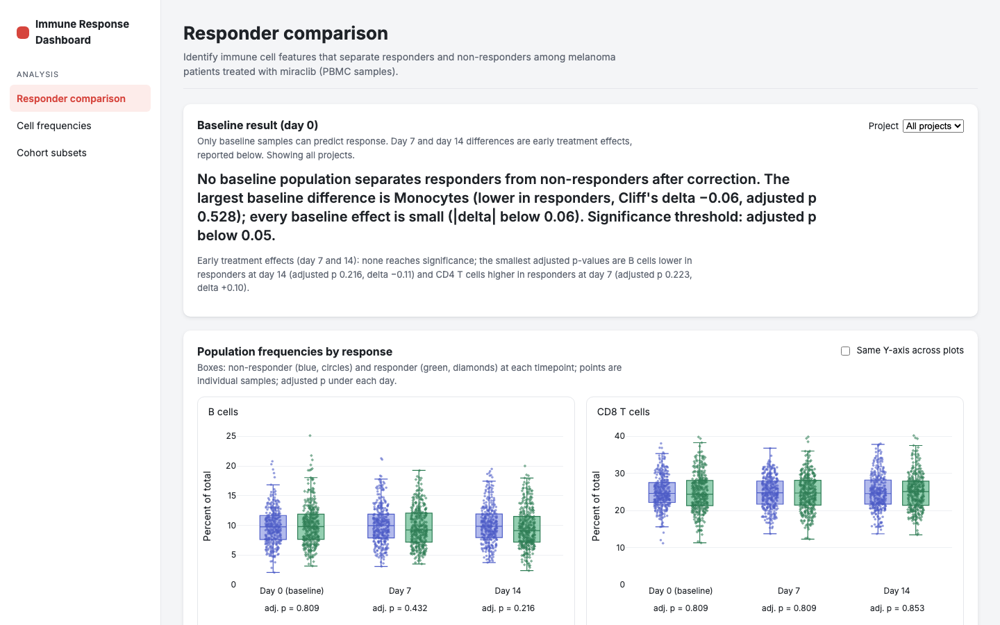

# Immune Response Dashboard

Explore how immune cell populations differ between responders and non-responders in a clinical trial dataset.

Live dashboard: https://immune-response-dashboard.vercel.app (the same app that `make dashboard` serves locally at http://localhost:8000)



## What it shows

The dashboard has two pages. Cohort analysis lets you pick a cohort with five filters and then shows what is in it: the composition, a one-line finding, a boxplot per population of cell frequency by day split by response, the statistics behind each panel, and the matching samples. Cell frequencies is the summary table, one row per population per sample, with search, sorting, paging and a CSV export.

The default cohort is melanoma patients on miraclib, PBMC samples, all projects and all timepoints: 1,968 samples from 656 subjects. In that cohort no population separates responders from non-responders once the p-values are corrected for multiple comparisons. The two largest differences, B cells lower in responders at day 14 (adjusted p 0.216) and CD4 T cells higher at day 7 (0.223), fall well short of significance.

### Cohort analysis page

Five filters define the cohort. Each takes `all` or one value from the data:

| Filter      | Values                            | Default  |
| ----------- | --------------------------------- | -------- |
| Condition   | all, melanoma, carcinoma, healthy | melanoma |
| Treatment   | all, miraclib, phauximab, none    | miraclib |
| Sample type | all, PBMC, WB                     | PBMC     |
| Project     | all, prj1, prj2, prj3             | all      |
| Timepoints  | all, 0, 7, 14                     | all      |

The Baseline only switch sets timepoints to day 0 and leaves the other four filters as they are. The Default cohort switch puts all five back to their defaults. Throughout this README a cohort means the group of samples the filters select, together with their subjects.

Above the charts, a single sentence names the population with the largest responder difference at the earliest selected day, says whether any test in the cohort came out significant, and gives the number of tests the adjusted p-values are corrected for. Hover a point in a boxplot to see that sample's count, population, sample and subject ids and response. Hover a box to see its maximum, upper fence, quartiles, median, lower fence and minimum. The U, BH-adjusted p, Cliff's delta and Significance columns of the statistics table each have a tooltip that explains them. The Matching samples table at the bottom lists every sample in the cohort with its subject, project, condition, treatment, sample type, timepoint, response and sex. It can be sorted and paged.

With every filter set to `all` the cohort is the whole dataset: 10,500 samples from 3,500 subjects. 1,422 of those samples have no recorded response. They belong to the 474 healthy subjects, who were not treated. The page counts them and says how many there are rather than putting them into the comparison.

## Run it

Prerequisites: Python 3.12+, Node 20+ with npm, make.

```bash
make setup      # creates .venv, installs Python and frontend dependencies, builds the frontend
make pipeline   # python load_data.py, then python -m analysis.pipeline; writes cell_counts.db
make dashboard  # serves API + dashboard at http://localhost:8000
```

**GitHub Codespaces**: Code, then Create codespace, wait for setup to finish (about two minutes after the codespace opens), run the three commands above, then click "Open in Browser" on the port 8000 notification.

Tests: `.venv/bin/python -m pytest`. Interactive API docs: `http://localhost:8000/api/docs`. `python load_data.py` alone creates the database with the raw tables and empty result tables.

### Options and troubleshooting

| Symptom or need                           | What to do                                                                     |
| ----------------------------------------- | ------------------------------------------------------------------------------ |
| Dashboard says "No pipeline output found" | `make pipeline`, then reload                                                   |
| Port 8000 is busy                         | `PORT=8001 make dashboard`                                                     |
| Frontend changed but the page looks stale | `REBUILD=1 make dashboard`                                                     |
| Use another interpreter or database path  | `PYTHON=/path/to/python`, `CELL_COUNTS_DB=/path/to.db` (the API also reads it) |
| Run the API without the built frontend    | `SERVE_FRONTEND=0`                                                             |

## How it is built

| Layer                  | Responsibility                                                                                                                                                                                                                                             |
| ---------------------- | ---------------------------------------------------------------------------------------------------------------------------------------------------------------------------------------------------------------------------------------------------------- |
| Pipeline (`analysis/`) | Reads the raw tables, runs the statistics for every selectable cohort, writes the result tables into `cell_counts.db`                                                                                                                                      |
| API (`server/`)        | Reads the pipeline's result tables, and for the selected cohort's filters runs COUNT/GROUP BY queries over the raw sample and subject tables to count, break down and list the matching samples. It does not import pandas or scipy and computes no statistics itself |
| Frontend (`frontend/`) | Fetches from the API and renders the two pages with React and Plotly                                                                                                                                                                                                            |

### Schema

The database has three raw tables and five result tables, all declared in `analysis/schema.py`. `load_data.py` creates the eight tables and fills the raw three from the CSV. The pipeline fills the rest. The CSV repeats a subject's metadata on every one of its rows, so the loader collapses that into one row per subject in `subjects` (and refuses to load a subject whose metadata differs between rows) and keeps the per-sample fields in `samples`.

`subjects`: one row per subject

| Column      | Type    | Key | Meaning                                                     |
| ----------- | ------- | --- | ----------------------------------------------------------- |
| `subject`   | TEXT    | PK  | subject id                                                  |
| `project`   | TEXT    |     | prj1, prj2 or prj3                                          |
| `condition` | TEXT    |     | melanoma, carcinoma or healthy                              |
| `age`       | INTEGER |     | age in years                                                |
| `sex`       | TEXT    |     | M or F (checked)                                            |
| `treatment` | TEXT    |     | miraclib, phauximab or none                                 |
| `response`  | TEXT    |     | yes or no (checked); NULL when no response was recorded     |

`samples`: one row per sample, with an index on `subject`

| Column                      | Type    | Key                     | Meaning                    |
| --------------------------- | ------- | ----------------------- | -------------------------- |
| `sample`                    | TEXT    | PK                      | sample id                  |
| `subject`                   | TEXT    | FK → `subjects.subject` | subject the sample is from |
| `sample_type`               | TEXT    |                         | PBMC or WB                 |
| `time_from_treatment_start` | INTEGER |                         | day 0, 7 or 14             |

`cell_counts`: one row per sample per population

| Column       | Type    | Key                       | Meaning                                              |
| ------------ | ------- | ------------------------- | ---------------------------------------------------- |
| `sample`     | TEXT    | PK, FK → `samples.sample` |                                                      |
| `population` | TEXT    | PK                        | b_cell, cd8_t_cell, cd4_t_cell, nk_cell or monocyte  |
| `count`      | INTEGER |                           | raw cell count, checked ≥ 0                          |

`sample_summary`: one row per sample per population (the Cell frequencies table)

| Column        | Type    | Key                       | Meaning                                           |
| ------------- | ------- | ------------------------- | ------------------------------------------------- |
| `sample`      | TEXT    | PK, FK → `samples.sample` |                                                   |
| `total_count` | INTEGER |                           | sum of the five populations' counts in the sample |
| `population`  | TEXT    | PK                        |                                                   |
| `count`       | INTEGER |                           | raw cell count                                    |
| `percentage`  | REAL    |                           | `count` as a percentage of `total_count`          |

`response_stats`: one row per cohort key, correction family, population and day. The first seven columns form the primary key. The first four are each `all` or one value. `timepoints` names the correction family: `all` means Benjamini-Hochberg ran across the three days' tests together, and `0`, `7` or `14` means it ran across that day's tests only.

| Column                      | Type    | Key | Meaning                                                                                                  |
| --------------------------- | ------- | --- | -------------------------------------------------------------------------------------------------------- |
| `condition`                 | TEXT    | PK  | `all` or a condition                                                                                     |
| `treatment`                 | TEXT    | PK  | `all` or a treatment                                                                                     |
| `sample_type`               | TEXT    | PK  | `all` or a sample type                                                                                   |
| `project`                   | TEXT    | PK  | `all` or a project                                                                                       |
| `timepoints`                | TEXT    | PK  | correction family: `all`, `0`, `7` or `14`                                                               |
| `population`                | TEXT    | PK  |                                                                                                          |
| `time_from_treatment_start` | INTEGER | PK  | the day this test compares                                                                               |
| `n_responders`              | INTEGER |     | samples with response yes in the test                                                                    |
| `n_nonresponders`           | INTEGER |     | samples with response no in the test                                                                     |
| `median_responders`         | REAL    |     | median percentage among responders                                                                       |
| `median_nonresponders`      | REAL    |     | median percentage among non-responders                                                                   |
| `u_statistic`               | REAL    |     | Mann-Whitney U, responders against non-responders                                                        |
| `p_raw`                     | REAL    |     | two-sided p-value                                                                                        |
| `p_adj`                     | REAL    |     | Benjamini-Hochberg adjusted p within the family                                                          |
| `effect_size`               | REAL    |     | Cliff's delta, positive when responders are higher                                                       |
| `significant`               | INTEGER |     | 1 when `p_adj` < 0.05, else 0 (checked)                                                                  |
| `status`                    | TEXT    |     | `ok` or `unavailable` (checked); the six statistics above are NULL when unavailable                      |
| `reason`                    | TEXT    |     | why the cell could not be tested, NULL when `ok`                                                         |

`response_strata`: one row per cohort key per correction family

| Column               | Type    | Key | Meaning                                              |
| -------------------- | ------- | --- | ---------------------------------------------------- |
| `condition`          | TEXT    | PK  | `all` or a condition                                 |
| `treatment`          | TEXT    | PK  | `all` or a treatment                                 |
| `sample_type`        | TEXT    | PK  | `all` or a sample type                               |
| `project`            | TEXT    | PK  | `all` or a project                                   |
| `timepoints`         | TEXT    | PK  | correction family: `all`, `0`, `7` or `14`           |
| `n_samples`          | INTEGER |     | matching samples                                     |
| `n_subjects`         | INTEGER |     | distinct subjects among them                         |
| `n_missing_response` | INTEGER |     | matching samples with no recorded response           |
| `n_tests`            | INTEGER |     | valid tests the correction ran across in this family |

`cohort_summary`: the default cohort at baseline, broken down for direct SQL inspection. The API recomputes these counts for whatever filters are selected.

| Column        | Type    | Key | Meaning                                            |
| ------------- | ------- | --- | -------------------------------------------------- |
| `breakdown`   | TEXT    | PK  | `project`, `response`, `sex` or `total`            |
| `category`    | TEXT    | PK  | the value within that breakdown                    |
| `n_samples`   | INTEGER |     | samples in the category                            |
| `n_subjects`  | INTEGER |     | distinct subjects in the category                  |
| `pct_samples` | REAL    |     | `n_samples` as a percentage of the cohort's samples |

`pipeline_meta`: provenance of the last pipeline run

| Column  | Type | Key | Meaning                                                                                         |
| ------- | ---- | --- | ----------------------------------------------------------------------------------------------- |
| `key`   | TEXT | PK  | `generated_at`, `csv_sha256`, `csv_rows`, `python_version`, `pandas_version` or `scipy_version` |
| `value` | TEXT |     |                                                                                                 |

### API

Every endpoint is a `GET` under `/api`.

| Path                                                 | Returns                                                                                                                                   |
| ---------------------------------------------------- | ----------------------------------------------------------------------------------------------------------------------------------------- |
| `/api/health`                                        | Row counts per table plus the `pipeline_meta` provenance                                                                                  |
| `/api/frequencies?search=&sort=&dir=&limit=&offset=` | One page of the cell-frequency table (`limit` 1 to 500, default 50; `offset` default 0); sorted and searched in SQL so a page stays a few KB |
| `/api/frequencies.csv?search=&sort=&dir=`            | The same table as a full CSV, every matching row, streamed                                                                                |
| `/api/cohort/options`                                | The distinct filter values available                                                                                                      |
| `/api/cohort/summary?…`                              | Sample and subject counts, how many matching samples have no recorded response, and breakdowns by project, response, sex and timepoint (the page shows the first three) |
| `/api/cohort/stats?…`                                | The cohort's `response_stats` rows including unavailable ones, the correction `family` they belong to, and `n_tests`                      |
| `/api/cohort/points?…`                               | Per-sample percentages behind the boxplots, for the samples with a recorded response                                                      |
| `/api/cohort/samples?…&sort=&dir=&limit=&offset=`    | One page of the matching samples (`limit` 1 to 500, default 50; `offset` default 0)                                                          |

Each cohort endpoint takes the same five filters as query parameters: `condition`, `treatment`, `sample_type`, `project` and `time_from_treatment_start`. Each is `all` or one value from the data. A missing parameter falls back to the default in the filter table above, and an unknown value gets a 422.

There are three requirements files. `requirements.txt` (fastapi, uvicorn) holds only what the API needs, because the hosted Python function installs from that file alone. `requirements-pipeline.txt` (pandas, scipy) is only needed to run the pipeline locally, and `requirements-dev.txt` (pytest, httpx, httpx2) only to run the tests.

The hosted copy serves a `cell_counts.db` that is committed to the repo. A local run regenerates it, so expect `make pipeline` to modify a tracked file.

## Analysis choices

### Per-timepoint tests

Every subject in the dataset has exactly three samples, one per timepoint (day 0, 7 and 14), and a single condition, treatment, sample type and project. So whatever the filters, a subject contributes at most one sample to any population by timepoint comparison. Pooling the three days into one test would count each person three times over. Mann-Whitney U therefore runs separately for each of the five populations at each selected day, which is 15 tests with all three days selected and 5 with a single day, with one sample per subject in every test. The pipeline re-checks the one-sample-per-subject condition for every cell it computes and, if the check ever fails, marks the cell unavailable instead of testing it. For reference, a naive pooled test over all 1,968 samples of the default cohort gives CD4 T cells p = 0.013. That number comes from exactly the double counting the per-timepoint design avoids, and the dashboard does not report it.

### Multiple comparisons

There is one correction rule. Benjamini-Hochberg runs once across every valid population by timepoint test in the selected cohort and timepoint selection, so up to 15 tests with all timepoints selected and up to 5 with one. The tooltip on the p (BH-adjusted) column says how many valid tests the correction ran across. Significant means adjusted p below 0.05, which the Significance column's tooltip also says. A cell that cannot be tested (no samples match, no recorded responses, one of the two response groups missing, or a subject contributing more than one sample) gets no p-value. It is listed with its reason and does not count as a non-significant test. Benjamini-Hochberg is the usual false discovery rate control for a family of tests like this. One caveat: the five percentages of a sample sum to 100, so the tests are not independent. BH's dependence assumptions are stated here rather than shown to hold for this data.

### Precomputed cohorts

The pipeline enumerates all 4 × 4 × 3 × 4 = 192 cohort keys over condition, treatment, sample type and project. For each key it computes the 15 population by timepoint cells once, 2,880 Mann-Whitney U tests in total, and then forms four correction families per key: all timepoints together, and day 0, 7 and 14 on their own. That gives 5,760 `response_stats` rows over 768 `response_strata` rows and takes about seven seconds. Changing a filter selects a family that has already been corrected instead of recomputing one, so the numbers on screen are the numbers the pipeline wrote.

### Effect size

Cliff's delta, computed as 2U / (n1·n2) − 1, positive when responders are higher. Every p-value is shown next to it, so a small but significant difference cannot be mistaken for a large one.

### Baseline and post-treatment days

Day 0 samples are taken before treatment. A difference at day 0 is therefore an association with a response recorded later, which is not the same as showing that the population predicts it. Day 7 and day 14 samples are taken after treatment started, so a difference there describes how the two response groups differ at that point. On its own it does not show that the population predicts response, and it does not show that the treatment caused the difference. The charts, the finding line and the Baseline only tooltip all label day 0 as baseline, and that switch narrows the cohort to day 0 in one click.

### Project as a filter

The default cohort spans two projects, prj1 (195 responders, 189 non-responders) and prj3 (136 and 136). Selecting one of them loads that cohort's own precomputed family with its own BH correction, rather than re-slicing the pooled numbers. The result is null within each project as well: the smallest adjusted p is 0.400 in prj1 (b_cell, day 14) and 0.560 in prj3 (monocyte, day 0). These agree with the pooled result, though agreement is all they show. They do not rule out confounding or an effect masked inside a project.

### Limitations

The comparison is not stratified by sex or age. Those would be the next checks if any population had shown a signal. Cohorts are limited to the five selectors, because those are the combinations the pipeline precomputes. A null result across a family of small effects means this dataset does not show a difference. It does not mean there is none.

### Baseline note

At baseline every subject contributes exactly one sample, so sample and subject counts coincide (656 and 656 in the default cohort). The query still counts distinct subjects rather than assuming this, and the cohort analysis page shows both counts for every breakdown.

[](https://github.com/bigbowlz/immune-response-dashboard/actions/workflows/ci.yml)

## License

MIT. See [LICENSE](LICENSE).
